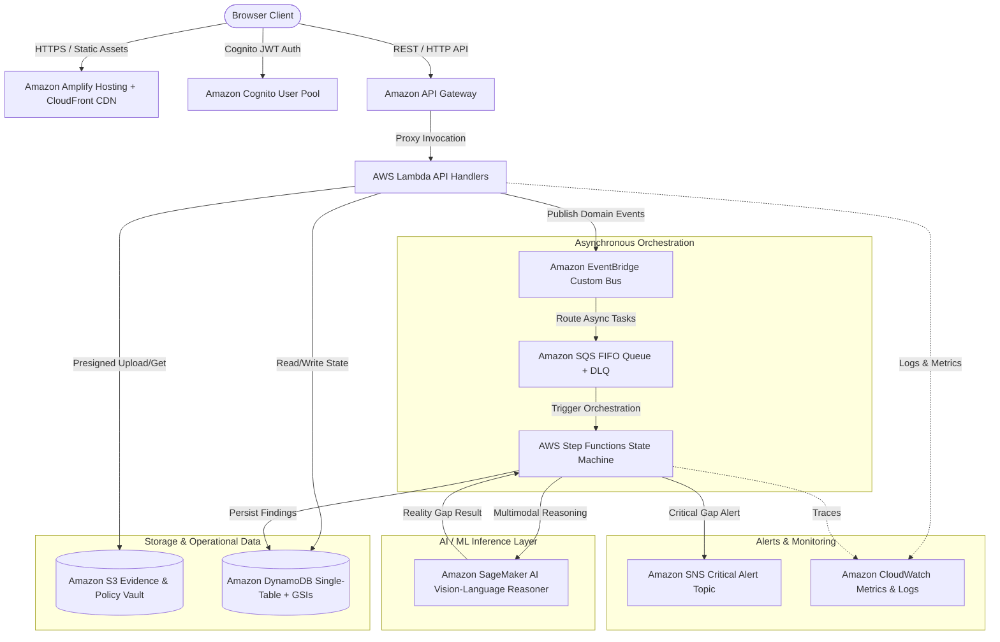

# GroundTruth — Production AWS Architecture

## Architecture Overview

GroundTruth is built natively on AWS using a fully event-driven, serverless, and decoupled microservices architecture designed specifically for the **AWS SHIP IT** track.

---

## 30-Second AWS Moment Pitch

> *"GroundTruth runs as an event-driven serverless AWS workflow. Evidence photographs and policy documents are stored in encrypted Amazon S3 buckets. Amazon API Gateway and AWS Lambda handle the serverless application layer. AWS Step Functions coordinates the multi-step inspection pipeline, invoking Amazon SageMaker AI for vision-language inference to compare expected rules against observed reality. Amazon DynamoDB stores operational state with single-digit millisecond latency, while Amazon EventBridge, SQS, and SNS handle asynchronous queues, domain events, and critical alerts."*

---

## Service-by-Service Responsibility Matrix

| AWS Service | Architecture Layer | Functional Purpose |
| :--- | :--- | :--- |
| **Amazon Amplify Hosting** | Frontend Edge | Global CDN distribution of React 18 single-page application with automatic HTTPS. |
| **Amazon API Gateway** | Public API Entrypoint | Low-latency HTTP API endpoint with CORS handling, rate-limiting, and Lambda proxy routing. |
| **AWS Lambda** | Compute & Microservices | Zero-idle Node.js 20 serverless handlers executing business logic, validation, and orchestrations. |
| **AWS Step Functions** | Workflow Orchestration | Multi-step state machine managing inspection lifecycle, error retries, and AI result persistence. |
| **Amazon SageMaker AI** | AI/ML Inference | Real-time hosted endpoint running multimodal vision-language reasoning on physical evidence. |
| **Amazon S3** | Object Storage | Highly durable storage for source policy PDFs, high-res evidence photos, and remediation proof. |
| **Amazon DynamoDB** | Operational Database | Serverless NoSQL table storing policies, requirements, inspections, findings, and audit trails. |
| **Amazon Cognito** | Identity & Security | Secure JWT authentication with role-based access control (Inspector, Manager, Verifier, Admin). |
| **Amazon EventBridge** | Eventing Fabric | Decoupled domain event bus broadcasting lifecycle state changes across the organization. |
| **Amazon SQS** | Async Task Buffer | FIFO message queue with Dead-Letter Queue (DLQ) for asynchronous inspection batching. |
| **Amazon SNS** | Push Notifications | Real-time notification dispatch for critical safety gaps and manager sign-off requests. |
| **Amazon CloudWatch** | Observability | Centralized telemetry, structured error logging, latency monitoring, and alarm dashboards. |
